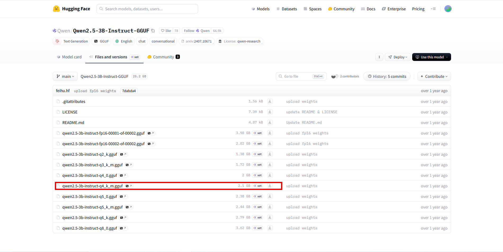

# Hybrid RAG Search System

로컬 환경에서 동작하는 하이브리드 검색 기반 RAG(Retrieval-Augmented Generation) 시스템입니다. GPU가 있으면 빠른 추론이 가능하고, CPU만으로도 동작합니다.

## 🎯 주요 기능

- **다양한 문서 형식 지원**: `.txt`, `.md`, `.json` 파일 업로드 및 처리
- **하이브리드 검색**: 의미 기반 검색(Dense)과 키워드 검색(Sparse)을 결합
  - **Dense Search**: 벡터 임베딩을 통한 의미적 유사도 검색
  - **Sparse Search**: BM25 알고리즘 기반 키워드 매칭
  - **Trigram Search**: 부분 단어 매칭을 위한 트라이그램 검색
  - **RRF (Reciprocal Rank Fusion)**: 세 가지 검색 결과를 통합
- **자연어 질의응답**: 업로드된 문서 기반 질문 답변 생성
- **출처 추적**: 답변에 사용된 문서 참조 정보 제공
- **GPU/CPU 지원**: GPU 사용 시 빠른 추론, CPU만으로도 동작 가능
- **서버 시작 시 자동 임베딩**: `data/` 폴더의 문서를 자동으로 임베딩하여 DB에 저장
- **기본 질문 응답**: 챗봇 역할, 기능 등 기본 질문에 대해 시스템 프롬프트 기반 응답 제공

## 🏗️ 기술 스택

### Backend
- **Framework**: FastAPI
- **Database**: PostgreSQL 15+ with pgvector, pg_trgm extensions
- **Embedding Models** (선택 가능):
  - `intfloat/multilingual-e5-base` (768차원, 다국어 지원, ~1GB) - 기본값
  - `sentence-transformers/all-MiniLM-L6-v2` (384차원, 영어 최적화, 빠름, ~90MB)
- **LLM**: Qwen 2.5-3B Instruct GGUF (llama-cpp-python, ~2.1GB)
- **Vector Search**: pgvector with HNSW index
- **Full-text Search**: PostgreSQL tsvector with BM25 ranking
- **Trigram Search**: pg_trgm extension

### Key Libraries
- `sentence-transformers`: 임베딩 생성
- `llama-cpp-python`: GGUF 모델 기반 LLM 추론 (GPU/CPU 지원)
- `asyncpg`: 비동기 PostgreSQL 드라이버
- `pydantic`: 데이터 검증 및 설정 관리

## 📋 시스템 요구사항

- **Python**: 3.11 이상
- **PostgreSQL**: 15 이상
- **RAM**: 최소 16GB (GPU 없는 경우), 8GB (GPU 사용 시)
- **GPU** (선택): CUDA 지원 GPU 권장 (VRAM 6GB 이상)
- **디스크 공간**: 약 8GB (모델 파일용)
- **OS**: Windows, Linux, macOS

## 🚀 빠른 시작

### 1. 데이터베이스 설정

```bash
# PostgreSQL 데이터베이스 생성
createdb ragtest

# 확장 기능 설치 (psql에서 실행)
psql -d ragtest -c "CREATE EXTENSION IF NOT EXISTS vector;"
psql -d ragtest -c "CREATE EXTENSION IF NOT EXISTS pg_trgm;"

# 스키마 초기화
psql -d ragtest -f src/db/schema.sql
```

### 2. Python 환경 설정

```bash
# 가상환경 생성 및 활성화
python -m venv venv
venv\Scripts\activate  # Windows
# source venv/bin/activate  # Linux/macOS

# 의존성 설치
pip install -r requirements.txt
```

### 3. 모델 다운로드

#### 임베딩 모델 (자동 다운로드)
임베딩 모델은 **첫 실행 시 자동으로 다운로드**됩니다:
- `intfloat/multilingual-e5-base` (~1GB)

다운로드된 모델은 `~/.cache/huggingface/` 디렉토리에 캐시됩니다.

#### LLM 모델 (수동 다운로드 필요)
LLM 모델은 Hugging Face에서 **직접 다운로드**해야 합니다:

1. [Qwen/Qwen2.5-3B-Instruct-GGUF](https://huggingface.co/Qwen/Qwen2.5-3B-Instruct-GGUF) 페이지로 이동
2. `qwen2.5-3b-instruct-q4_k_m.gguf` 파일 다운로드 (~2.1GB)
3. 다운로드한 파일을 `models/` 폴더에 저장



```bash
# models 폴더 생성 (없는 경우)
mkdir models

# 다운로드한 파일을 models 폴더로 이동
# 최종 경로: models/qwen2.5-3b-instruct-q4_k_m.gguf
```

> **참고**: 다른 양자화 버전을 사용하려면 `.env`에서 `LLM_MODEL_PATH` 설정을 변경하세요.

### 4. 환경 변수 설정

`.env` 파일을 프로젝트 루트에 생성:

```env
# Database
DATABASE_URL=postgresql://localhost/ragtest
DATABASE_USER=postgres
DATABASE_PASSWORD=
DATABASE_HOST=localhost
DATABASE_PORT=5432
DATABASE_NAME=ragtest

# Models
# 임베딩 모델 타입 선택 (다음 중 하나를 선택):
#   - multilingual: intfloat/multilingual-e5-base (다국어 지원, 기본값)
#   - minilm: sentence-transformers/all-MiniLM-L6-v2 (영어 최적화, 빠름)
EMBEDDING_MODEL_TYPE=multilingual

# LLM 모델 설정 (GGUF 형식)
LLM_MODEL_PATH=./models/qwen2.5-3b-instruct-q4_k_m.gguf
LLM_CONTEXT_LENGTH=4096
LLM_GPU_LAYERS=0  # GPU 사용 시 레이어 수 설정 (0=CPU only)

# Server
HOST=0.0.0.0
PORT=8000
DEBUG=true

# Search
DEFAULT_TOP_K=5
RRF_K=60

# Chunking
CHUNK_SIZE=512
CHUNK_OVERLAP=50
```

### 5. 서버 실행

```bash
# 개발 모드
uvicorn src.main:app --reload --host 0.0.0.0 --port 8000

# 프로덕션 모드
uvicorn src.main:app --host 0.0.0.0 --port 8000 --workers 1
```

서버가 실행되면 다음 URL에서 확인할 수 있습니다:
- **API 문서**: http://localhost:8000/docs
- **Health Check**: http://localhost:8000/health

### 6. 문서 자동 임베딩 (선택)

`data/` 폴더에 문서를 넣어두면 서버 시작 시 자동으로 임베딩됩니다:

```bash
# data 폴더 생성
mkdir data

# 문서 파일 추가 (txt, md, json 지원)
cp your-documents/*.md data/
```

서버 시작 시 콘솔에서 확인:
```
Loading documents from data folder...
  Loaded: document1.md (5 chunks)
  Loaded: document2.txt (3 chunks)
  Skipping (already exists): document3.md
Documents loaded.
```

> **참고**: 이미 DB에 존재하는 파일은 자동으로 스킵됩니다.

## 📖 사용 방법

### 문서 업로드

```bash
# 텍스트 파일 업로드
curl -X POST http://localhost:8000/api/documents \
  -F "file=@sample.txt"

# 마크다운 파일 업로드
curl -X POST http://localhost:8000/api/documents \
  -F "file=@README.md"

# JSON 파일 업로드
curl -X POST http://localhost:8000/api/documents \
  -F "file=@data.json"
```

### 문서 목록 조회

```bash
curl http://localhost:8000/api/documents
```

### 질문하기

```bash
curl -X POST http://localhost:8000/api/chat \
  -H "Content-Type: application/json" \
  -d '{"question": "이 문서의 주요 내용은 무엇인가요?"}'
```

### 검색만 수행 (답변 생성 없이)

```bash
curl -X POST http://localhost:8000/api/search \
  -H "Content-Type: application/json" \
  -d '{
    "query": "hybrid search",
    "top_k": 5,
    "search_type": "hybrid"
  }'
```

## 🧪 테스트

```bash
# 전체 테스트 실행
pytest

# 커버리지 포함
pytest --cov=src --cov-report=html

# 특정 테스트 카테고리
pytest tests/unit/          # 단위 테스트
pytest tests/integration/   # 통합 테스트
pytest tests/contract/      # 계약 테스트
```

## 📊 성능 지표

| 작업 | GPU | CPU |
|------|-----|-----|
| 첫 모델 로딩 | 30-60초 | 60-120초 |
| 문서 업로드 (1MB) | < 5초 | < 10초 |
| 질문 답변 생성 | 2-5초 | 20-60초 |
| 검색만 수행 | < 1초 | < 2초 |

## 🏛️ 아키텍처

### 데이터 모델

```
Document (문서)
  ├── id: UUID
  ├── filename: VARCHAR(255) UNIQUE
  ├── content: TEXT
  ├── format: VARCHAR(10) ['txt', 'md', 'json']
  └── chunks: Chunk[]

Chunk (청크) - 선택된 임베딩 모델에 따라 다른 테이블 사용
  ├── chunks_768 (multilingual-e5-base용)
  │   ├── id: UUID
  │   ├── document_id: UUID (FK)
  │   ├── content: TEXT
  │   ├── chunk_index: INTEGER
  │   ├── embedding: VECTOR(768)
  │   └── search_vector: TSVECTOR
  │
  └── chunks_384 (all-MiniLM-L6-v2용)
      ├── id: UUID
      ├── document_id: UUID (FK)
      ├── content: TEXT
      ├── chunk_index: INTEGER
      ├── embedding: VECTOR(384)
      └── search_vector: TSVECTOR
```

### 검색 파이프라인

1. **문서 업로드** → 텍스트 추출 → 청킹 (512 토큰, 50 토큰 오버랩)
2. **임베딩 생성** → pgvector에 저장
3. **검색 인덱스 생성** → tsvector (BM25), trigram
4. **하이브리드 검색**:
   - Dense Search (벡터 유사도)
   - BM25 Search (키워드 매칭)
   - Trigram Search (부분 매칭)
   - RRF로 결과 통합
5. **답변 생성** → LLM에 컨텍스트 전달 → 자연어 답변 생성

## 🔧 문제 해결

### "Model file not found" 오류
- GGUF 모델 파일이 `models/` 폴더에 있는지 확인
- `.env`의 `LLM_MODEL_PATH` 경로가 정확한지 확인
- 모델 파일명: `qwen2.5-3b-instruct-q4_k_m.gguf`

### "llama-cpp-python not installed" 오류
- 필수 패키지 설치: `pip install llama-cpp-python`
- GPU 지원 버전 설치: `CMAKE_ARGS="-DGGML_CUDA=on" pip install llama-cpp-python`

### "CUDA out of memory" 오류
- `.env`에서 `LLM_GPU_LAYERS=0`으로 설정하여 CPU 모드 사용
- 또는 더 작은 양자화 모델 사용: `qwen2.5-3b-instruct-q2_k.gguf`

### "Database connection failed" 오류
- PostgreSQL이 실행 중인지 확인: `pg_isready`
- `.env`의 `DATABASE_URL` 확인
- pgvector 확장이 설치되었는지 확인:
  ```sql
  SELECT * FROM pg_extension WHERE extname = 'vector';
  ```

### "Out of memory" 오류 (RAM)
- CPU 모드에서는 RAM 16GB 이상 권장
- 다른 애플리케이션을 종료하여 RAM 확보
- `.env`에서 `CHUNK_SIZE` 줄이기

### 응답 속도가 느림
- GPU 사용 권장: `.env`에서 `LLM_GPU_LAYERS` 설정 (예: 35)
- 첫 요청은 모델 로딩으로 시간 소요 (이후 요청은 빠름)
- 더 작은 양자화 모델 사용 고려: `qwen2.5-3b-instruct-q2_k.gguf` (~1.4GB)

## 📝 테스트용 샘플 파일

**sample.txt**:
```
하이브리드 검색은 밀집 검색과 희소 검색을 결합한 방법입니다.
밀집 검색은 의미적 유사성을 기반으로 하고,
희소 검색은 키워드 매칭을 기반으로 합니다.
Reciprocal Rank Fusion을 사용하여 두 결과를 통합합니다.
```

**sample.json**:
```json
{
  "title": "RAG System Overview",
  "content": "Retrieval-Augmented Generation combines search with language models.",
  "topics": ["AI", "NLP", "Search"]
}
```

## 🎯 주요 기능 요구사항

- ✅ txt, md, json 파일 업로드 지원
- ✅ 의미 기반 검색 (Dense Search)
- ✅ 키워드 검색 (BM25)
- ✅ 트라이그램 검색 (부분 매칭)
- ✅ 하이브리드 검색 (RRF 통합)
- ✅ 자연어 질의응답
- ✅ 출처 참조 제공
- ✅ GPU/CPU 모두 지원 (GPU 자동 감지)
- ✅ 동시 요청 처리
- ✅ 중복 파일명 자동 교체
- ✅ 서버 시작 시 data 폴더 자동 임베딩
- ✅ 기본 질문(역할, 기능 등)에 대한 시스템 응답

## 📄 라이선스

이 프로젝트는 로컬 개발 및 테스트 목적으로 제작되었습니다.

## 🤝 기여

이슈 및 풀 리퀘스트를 환영합니다!

---

**개발 시작일**: 2026-01-27  
**상태**: 개발 중 (Draft)
